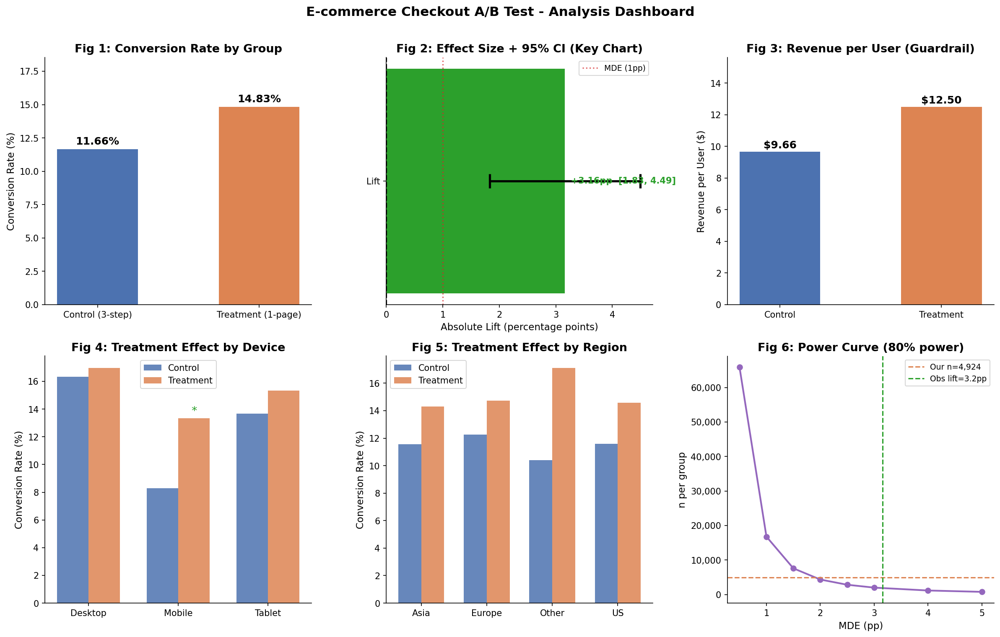
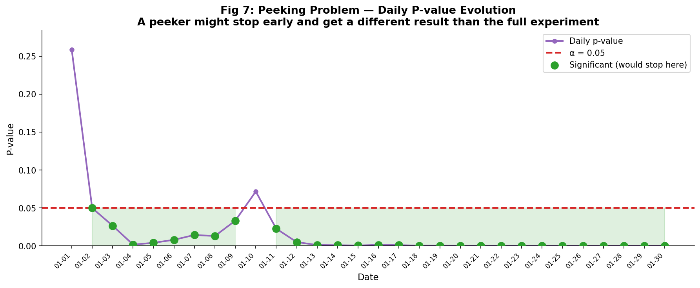

# E-commerce Checkout A/B Test Analysis

> **Did the new one-page checkout genuinely improve conversion rate, or was it just random chance?**

---

## Decision: SHIP THE NEW CHECKOUT

| Metric | Control | Treatment |
|---|---|---|
| Conversion Rate | 11.66% | 14.83% |
| Absolute Lift | — | +3.16pp |
| Relative Lift | — | +27.1% |
| P-value | — | 0.000003 |
| 95% CI | — | [+1.83pp, +4.49pp] |
| Revenue per User | $9.66 | $12.50 |
| Statistical Power | — | 99.6% |

---

## Dashboard





---

## Project Overview

An e-commerce company redesigned their checkout from a **3-step multi-page flow** to a **simplified one-page checkout**. As the analyst, I ran a full A/B test analysis to determine whether the change genuinely improved conversion rate.

This project demonstrates:
- Experiment design and validation
- Statistical hypothesis testing
- Effect size and confidence intervals
- Power analysis
- A/B testing pitfall identification
- Business decision-making from data

---

## Project Structure

```
ecommerce-ab-test/
├── data/
│   └── ab_test_raw.csv           <- 10,200 rows experiment dataset
├── notebooks/
│   └── ab_test_analysis.ipynb    <- Full 10-phase analysis
├── src/
│   ├── data_generation.py        <- Realistic data simulator
│   ├── data_validation.py        <- SRM, quality checks
│   ├── statistical_tests.py      <- Z-test, CI, segments, pitfalls
│   └── power_analysis.py         <- Sample size, MDE, power curve
├── visualizations/
│   ├── clean_dashboard.png       <- Main analysis dashboard
│   └── peeking_simulation.png    <- Peeking pitfall chart
├── requirements.txt
└── README.md
```

---

## 10-Phase Analysis

### Phase 1 — Data Generation
Simulated 10,000 users over 30 days with realistic assumptions:
- Baseline conversion rate: 12.5%
- Device-specific conversion differences (mobile < desktop)
- Right-skewed revenue distribution (lognormal, AOV ~$85)
- 2% duplicate sessions injected for deduplication practice

### Phase 2 — Data Quality & Experiment Validation
Ran all critical checks before any statistical test:
- No missing values
- 200 duplicate sessions removed
- No Sample Ratio Mismatch (chi-sq=2.31, p=0.13)
- Device and region balanced across groups
- 30-day duration covers full weekday/weekend cycles

### Phase 3 — Metric Definition
- **Primary:** Conversion Rate
- **Guardrail:** Revenue per User, Average Order Value

### Phase 4 — Hypothesis Testing
- Test: Two-proportion z-test (large n, binary outcome)
- H0: p_control = p_treatment
- H1: p_control != p_treatment (two-tailed, alpha=0.05)
- Result: p = 0.000003 — statistically significant

### Phase 5 — Practical Significance
- Lift of +3.16pp exceeds 1pp business threshold
- ~156 additional conversions per 10,000-user cohort
- ~$13,000 estimated revenue uplift per cohort

### Phase 6 — Power Analysis
- Required sample: 1,800 per group
- Actual sample: ~5,000 per group
- Achieved power: 99.6% — well-powered experiment

### Phase 7 — Experiment Pitfalls
Analyzed 6 common A/B testing mistakes:
1. Sample Ratio Mismatch — checked via chi-square
2. Peeking — simulated daily p-value evolution
3. Multiple Comparisons — Bonferroni correction applied
4. Simpson's Paradox — subgroup direction consistency verified
5. Selection Bias — mitigated by server-side randomization
6. Insufficient Sample Size — confirmed adequate n via power analysis

### Phase 8 — Segment Analysis

By Device (Bonferroni alpha = 0.0167):

| Device | Control CVR | Treatment CVR | Lift | Significant? |
|---|---|---|---|---|
| Mobile | 8.29% | 13.33% | +5.05pp | Yes |
| Desktop | 16.33% | 16.98% | +0.65pp | No |
| Tablet | 13.68% | 15.34% | +1.66pp | No |

Key insight: Mobile users drive the lift — the 1-page checkout eliminates scrolling friction on small screens.

### Phase 9 — Visualizations
- Conversion rate comparison
- Effect size + 95% confidence interval (key chart)
- Revenue per user guardrail
- Segment analysis by device and region
- Power curve
- Peeking simulation

### Phase 10 — Business Recommendation
SHIP — The new checkout is statistically and practically significant. Revenue per user increased 29%. Experiment was well-powered. Recommend full rollout with 30-day post-launch monitoring.

---

## Key Interview Talking Points

| Topic | Talking Point |
|---|---|
| Why validate first? | SRM and data issues invalidate results even if p < 0.05 |
| Why z-test? | Large n, binary outcome, two independent groups |
| Why show CI not just p-value? | CI tells you the range and whether it is meaningful |
| Stat sig vs practical sig? | Large n makes tiny effects significant — need a business threshold |
| What is peeking? | Stopping early when p < 0.05 inflates false positive rate |
| What is SRM? | Split deviates from intended — suggests broken randomization |
| What is Simpson's Paradox? | Aggregate result can reverse in subgroups |
| Multiple comparisons? | 8 segment tests at alpha=0.05 gives 34% false positive chance — use Bonferroni |
| Power analysis? | Required 1,800 per group, had 5,000 — 99.6% power |

---

## Tech Stack

| Tool | Usage |
|---|---|
| Python 3.11 | Core language |
| pandas | Data manipulation |
| NumPy | Simulation, numerical ops |
| SciPy | Z-test, chi-square, Mann-Whitney |
| statsmodels | Proportions z-test, power analysis |
| Matplotlib | Visualizations |
| Jupyter Notebook | Analysis environment |

---

## How to Run

```bash
# Install dependencies
pip install -r requirements.txt

# Open the notebook
jupyter notebook notebooks/ab_test_analysis.ipynb

# Run all cells top to bottom
# All charts and results generate automatically
```

---

## Portfolio Context

| Project | Skills |
|---|---|
| Flipkart Price Intelligence Dashboard | Data pipeline, web scraping, anomaly detection, Power BI |
| E-commerce A/B Test Analysis | Experiment design, hypothesis testing, statistical inference, power analysis |

Together these two projects cover the full Data Analyst skillset.

---

Tools: Python, pandas, NumPy, SciPy, statsmodels, Matplotlib, Jupyter
